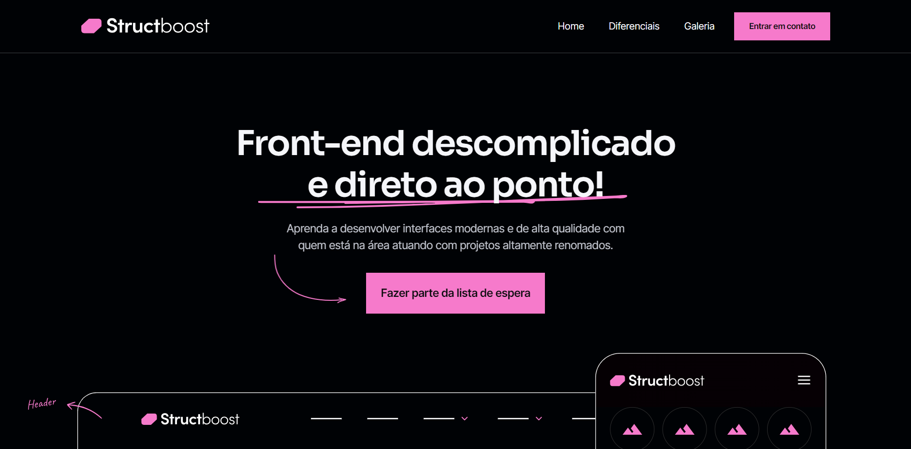

<h1 align="center"> Spider-Man 2 </h1>

Landing page do jogo <strong>Spider-Man 2</strong> desenvolvida durante o evento DevProcess do curso CodeBoost.
 
 
O DevProcess é um evento on-line e gratuito, promovido pelo CodeBoost e aconteceu entre os dias 21 e 24 de novembro de 2023.
  

  <a href="#-tecnologias">Tecnologias</a>&nbsp;&nbsp;&nbsp;|&nbsp;&nbsp;&nbsp;
  <a href="#-projeto">Projeto</a>&nbsp;&nbsp;&nbsp;|&nbsp;&nbsp;&nbsp;
  <a href="#memo-licença">Licença</a>

  

 

  

## 🚀 Tecnologias

Esse projeto foi desenvolvido com as seguintes tecnologias:

- HTML, SCSS
- JavaScript
- Git e Github
- Figma

## 💻 Projeto

O projeto foi desenvolvido com o objetivo de aperfeiçoar os conhecimentos nas tecnologias utilizadas para a criação de uma landing page baseada no jogo Spider-Man 2

- [Visite o projeto online](https://github.com/charlesalmeiida/spider-man-2)

## 🔖 Layout

Você pode visualizar o resultado do projeto através [DESSE LINK](https://charlesalmeiida.github.io/spider-man-2/).
